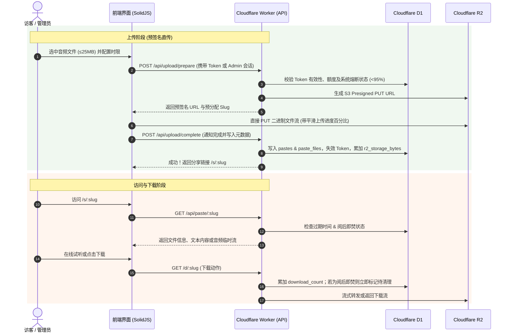

# Cloudflare Pastebin & 资源分享系统需求与架构设计规格书 (PRD)

> **版本**：v1.0  
> **状态**：已定稿待评审  
> **技术栈**：`Bun + TypeScript + SolidJS (SolidStart) + TailwindCSS + Cloudflare D1 + Cloudflare R2 + Workers (Static Assets & Crons)`

---

## 1. 项目背景与设计目标

本项目旨在构建一个高安全、轻量级、面向站长个人及极少数信任外人的私有 Pastebin 与多媒体文件分享系统，完全基于 Cloudflare 免费生态部署。

### 核心设计原则
1. **零成本与硬顶安全**：精准把控在 Cloudflare Free Plan 额度边界内，内置双阶熔断防护，杜绝任何超额产生扣费的可能。
2. **隐私与最小授权**：禁止公开无门槛上传，杜绝机器人扫描与恶意占用；外人上传采用“一次性带配额 Token 链接”，用完即作废。
3. **极佳用户体验**：
   - 绿色清新简约的主色调，活力橙用于重点操作与强调提示；
   - 客户端 R2 预签名直传，大文件（音频等 ≤25MB）平滑上传进度条；
   - 分享链接自带优雅落地页（在线试听音频、代码语法高亮），兼顾直链直下能力。

---

## 2. 系统核心功能与详细规格

### 2.1 访问控制与上传权限模型
- **管理员特权**：
  - 访问 `/admin` 通过环境变量 `ADMIN_PASSWORD` 登录；
  - 登录后签发 HttpOnly 签名 Cookie 会话（支持 7 天免密）；
  - 管理员拥有内置上传面板，可无额度限制直接上传（单文件上限 25MB），可选择无过期时间（永久）；
  - 管理员在后台查阅、预览、下载任何资源，**不会消耗**阅后即焚计数。
- **外部访客上传凭证（一次性 Token 链接）**：
  - 管理员在管理面板生成带有专属 Token 的 URL（形如 `https://domain.com/upload?token=<UUID>`）；
  - 生成时由管理员指定：
    1. **Token 有效期**（如 1 小时、1 天、3 天等，逾期未用自动作废）；
    2. **允许上传的总文件容量配额**（如 25MB、50MB 等）；
    3. **是否允许开启永久保存**（默认关闭）；
  - **使用生命周期规则**：
    - 一个 Token 仅允许提交一次；
    - 在提交前，访客可以在总配额范围内自由添加 1 个或多个文件（支持音频、文本等）；
    - 页面实时展示已添加文件大小与剩余配额；
    - 点击“生成分享”完成上传后，该 Token **立即标记为已使用并失效**，无法二次上传。

---

### 2.2 短链接生成与路由规格
- **路由前缀隔离**：所有分享落地页统一挂在 `/s/:slug` 路由下，彻底避免与系统路由（`/admin`, `/api`, `/upload`, `/assets` 等）冲突。
- **直链/原始数据路由**：挂在 `/d/:slug` 或落地页一键直链（包含 `Content-Disposition: inline` 或 `attachment`）。
- **生成字符集与防爆破策略**：
  - **字符集**：Base62 `[a-zA-Z0-9]`；
  - **生成长度**：默认 4 位（约 1477 万种组合），可选 8 位（约 218 万亿种组合）、16 位；
  - **安全规则**：**禁止用户手敲自定义后缀**，由后端系统随机生成并进行唯一性校验冲突重试，防止外人爆破、枚举或抢注常见词汇。

---

### 2.3 落地分享页与在线交互体验
- **UI 风格设计**：
  - **主色调**：清新抹茶/鼠尾草绿（Sage / Emerald Green），呈现干净、简约、轻量之美；
  - **点缀色**：活力橙（Warm Amber / Vibrant Orange），用于 Primary CTA 按钮、复制成功反馈、紧急警示及关键倒计时；
  - **自适应**：原生响应式移动端/桌面端适配。
- **多类型资源渲染**：
  - **音频文件**：内嵌 HTML5 音频播放器，支持波形/进度拖动与在线直接试听；
  - **纯文本**：支持代码高亮与自动行号，提供一键复制代码与 Raw 纯文本查看；
  - **多文件合集**：单次上传多个文件时，以清单卡片形式列出，支持单项试听/下载及批量下载；
  - **状态显示**：顶部展示过期倒计时卡片，醒目标记“阅后即焚”标签。

---

### 2.4 过期策略与自动物理清理
- **过期时限档位**：
  - 预设选项：`1小时` / `1天`（默认） / `7天`；
  - 勾选选项：“阅后即焚”（外人完成首次成功下载后立即触发销毁）；
  - 权限拓展：若属于管理员上传或 Token 被特批允许，额外显示“永久保存（无过期）”选项。
- **双重清理机制**：
  1. **访问时惰性判定（Lazy Expiry）**：用户访问已被标记过期或阅后即焚已耗尽的资源时，立即返回 404/已过期页面，并在 Worker 后台触发物理删除。
  2. **Cron 定时扫描清理**：配置 Cloudflare Worker 原生 Crons 定时任务（如 `0 * * * *` 每小时一次），批量扫描 D1 中已过期的记录，调用 R2 `bucket.delete(keys)` 物理删除并同步扣减 D1 存储总用量。

---

### 2.5 Cloudflare 免费额度监控与双阶熔断防护体系
为杜绝任何产生费用的风险，系统在 D1 中设计 `system_metrics` 实时用量指标表：

| 监控指标项 | Cloudflare 免费额度 | 80% 警戒水位 | 95% 熔断安全红线 | 统计重置周期 |
| :--- | :--- | :--- | :--- | :--- |
| **R2 存储占用容量** | 10 GB (10,737,418,240 B) | 8.0 GB | 9.5 GB | 实时增减 |
| **R2 Class A 操作 (写/列取)** | 1,000,000 次/月 | 800,000 次 | 950,000 次 | 每月 1 日 00:00 UTC |
| **R2 Class B 操作 (读/下载)** | 10,000,000 次/月 | 8,000,000 次 | 9,500,000 次 | 每月 1 日 00:00 UTC |
| **Worker / API 请求数** | 100,000 次/天 | 80,000 次 | 95,000 次 | 每日 00:00 UTC |

- **行为阶梯响应**：
  1. **常规状态 (<80%)**：管理后台显示绿色健康指示，所有功能完全开放。
  2. **黄色预警 (80% ~ 95%)**：系统所有功能继续正常可用，管理后台仪表盘亮起黄色高亮警告卡片，提醒管理员当前接近上限。
  3. **红色熔断 (≥95%)**：
     - **前台访客服务**：立即停止所有新上传与新分享访问，展示友好的熔断停服通知并明确告知具体超限原因；
     - **管理端特权**：**始终可用**！管理员仍可正常登录管理面板；
     - **恢复逻辑**：
       - 若为**存储空间**超限：管理员在后台手动删除文件或等待系统自动清理后，存储量降回 95% 以下立即全自动解除熔断；
       - 若为**操作数/请求数**超限：明确提示等待配额周期刷新，在此期间管理员仍可执行删除清理操作。

---

### 2.6 管理者面板（Admin Console）功能清单
1. **身份鉴权**：
   - 环境变量 `ADMIN_PASSWORD` + HMAC 签名会话 Cookie；
   - 防暴力破解：连续输错 5 次密码锁定 IP 15 分钟。
2. **仪表盘 (Quota Dashboard)**：
   - R2 存储空间使用环形/进度图（实时 MB/GB、已用百分比、剩余空间）；
   - 本月 Class A / Class B 操作数、今日 API 请求数柱状进度；
   - 系统当前运行状态（正常 / 预警 / 熔断中）。
3. **快捷上传模块**：
   - 供管理员自用的内嵌拖拽上传区，直接生成短链接，支持单文件 25MB 内自由上传，支持永久有效选项。
4. **分享管理列表 (Pastes & Files)**：
   - 表格字段：短链 Slug、标题/文件名、类型（音频/文本/合集）、体积大小、创建时间、过期时间（倒计时/永久）、下载次数、阅后即焚状态；
   - 快捷操作：预览查看、复制前台链接、复制直连、立即物理删除。
5. **上传 Token 凭证派发管理**：
   - 生成新 Token 抽屉：选择有效期、最大总容量配额、是否允许永久选项；
   - 复制完整上传链接（含 `?token=...`）；
   - Token 列表：显示状态（未使用 / 已使用 / 已过期）、已消耗大小、作废按钮。

---

## 3. 技术架构与数据库设计

### 3.1 总体架构选型
- **全栈框架**：SolidStart + TypeScript + TailwindCSS
- **运行时环境**：Cloudflare Workers with Static Assets（单体全栈工程，由 Wrangler 一键管理）
- **定时调度**：Wrangler 原生 `[triggers] crons = ["0 * * * *"]`
- **存储拓扑**：
  - **Cloudflare D1**：轻量关系型 SQLite，存储 Paste 元数据、Token、用量指标与纯文本内容；
  - **Cloudflare R2**：对象存储桶，存储音频与附件文件；客户端直传（S3 Presigned PUT URL）避免 Worker 内存瓶颈。

### 3.2 数据库 Schema 设计 (Cloudflare D1)

```sql
-- 1. 系统度量统计与熔断表
CREATE TABLE IF NOT EXISTS system_metrics (
  key TEXT PRIMARY KEY,            -- 指标键名 (r2_storage_bytes, r2_class_a_month, r2_class_b_month, worker_req_day)
  value INTEGER NOT NULL DEFAULT 0, -- 当前数值
  updated_at TEXT NOT NULL         -- 最后更新时间
);

-- 2. 上传凭证 Token 表
CREATE TABLE IF NOT EXISTS upload_tokens (
  id TEXT PRIMARY KEY,             -- Token 唯一标识 (UUIDv4)
  max_size_bytes INTEGER NOT NULL, -- 允许的最大总文件容量 (例如 52428800 代表 50MB)
  used_size_bytes INTEGER DEFAULT 0,-- 实际上传消耗的容量
  allow_permanent INTEGER DEFAULT 0,-- 是否允许该 Token 选择永久不过期 (1: 允许, 0: 禁止)
  status TEXT NOT NULL DEFAULT 'active', -- active (激活可用), used (已消费作废), expired (超时作废)
  expires_at TEXT NOT NULL,        -- Token 自身的有效期截止时间
  created_at TEXT NOT NULL         -- 创建时间
);

-- 3. 分享主体信息表 (Pastes)
CREATE TABLE IF NOT EXISTS pastes (
  id TEXT PRIMARY KEY,             -- 内部 ID
  slug TEXT UNIQUE NOT NULL,       -- 短链标识 (4/8/16 位随机字符)
  type TEXT NOT NULL,              -- text (纯文本), single_file (单文件), multi_file (多文件合集)
  title TEXT,                      -- 分享标题/备注
  text_content TEXT,               -- 若为文本类型，直接保存在 D1 中 (节约 R2 操作数)
  total_size_bytes INTEGER DEFAULT 0, -- 总大小
  burn_after_read INTEGER DEFAULT 0, -- 是否阅后即焚 (1: 是, 0: 否)
  view_count INTEGER DEFAULT 0,    -- 访问/试听次数
  download_count INTEGER DEFAULT 0,-- 实际下载触发次数
  expires_at TEXT,                 -- 过期时间戳 (NULL 表示永久无过期)
  created_at TEXT NOT NULL,        -- 创建时间
  created_by_token TEXT,           -- 关联的 upload_tokens.id (管理员创建则为 NULL)
  is_deleted INTEGER DEFAULT 0     -- 软删除/待清理标记
);

-- 4. 文件详情表 (Files)
CREATE TABLE IF NOT EXISTS paste_files (
  id TEXT PRIMARY KEY,             -- 文件 ID
  paste_id TEXT NOT NULL,          -- 关联 pastes.id
  r2_key TEXT NOT NULL,            -- R2 存储桶中的对象 Key
  filename TEXT NOT NULL,          -- 原始文件名
  mime_type TEXT NOT NULL,         -- MIME 类型 (如 audio/mpeg)
  size_bytes INTEGER NOT NULL,     -- 文件字节大小
  created_at TEXT NOT NULL,
  FOREIGN KEY (paste_id) REFERENCES pastes(id) ON DELETE CASCADE
);
```

---

## 4. 上传与下载技术实现链路



---

## 5. 阶段实施计划（暂不编码，待主人指令）

- **Phase 1**：环境与工程脚手架（SolidStart + TailwindCSS + Wrangler + D1/R2 本地模拟绑定）
- **Phase 2**：核心后端服务（D1 Migrations、Token 校验、额度双阶计算与熔断拦截、Presigned URL 签发）
- **Phase 3**：前台界面构建（清新绿+暖橙配色、Token 输入与多文件/文本上传页、进度条、音频落地分享页）
- **Phase 4**：管理员面板开发（密码认证会话、用量仪表盘、Token 派发抽屉、分享列表查删、管理员自用上传）
- **Phase 5**：定时任务与阅后即焚清理（Cron Handler、惰性过期清理、自动化集成测试与部署文档）
